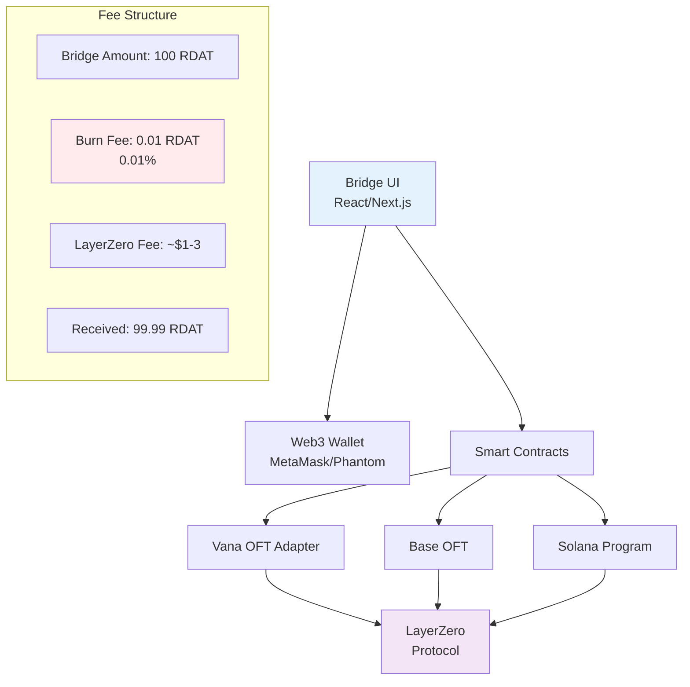

# RDAT Bridge Frontend Integration Guide

**Purpose**: Build a custom bridge UI for RDAT with a 0.01% burn fee mechanism

## 🎯 Overview

This guide helps frontend developers create a custom bridge interface for RDAT tokens across Vana, Base, and Solana, implementing a 0.01% burn fee on every bridge transaction to create deflationary pressure.

## 🏗 Architecture



## 📋 Requirements

### Smart Contract Modifications Needed

**IMPORTANT**: The burn fee requires modifying the OFT contracts. Since contracts are already deployed, you'll need to:

1. **Option A**: Deploy new wrapper contracts with fee logic
2. **Option B**: Use a frontend-only burn (less secure but immediate)
3. **Option C**: Upgrade via multisig (if upgradeable)

### Frontend Tech Stack

```json
{
  "dependencies": {
    "@layerzerolabs/lz-sdk": "latest",
    "@solana/web3.js": "^1.87.0",
    "@solana/spl-token": "^0.3.9",
    "ethers": "^6.9.0",
    "wagmi": "^2.0.0",
    "viem": "^2.0.0",
    "@rainbow-me/rainbowkit": "^2.0.0",
    "@solana/wallet-adapter-react": "^0.15.0",
    "react": "^18.2.0",
    "next": "^14.0.0"
  }
}
```

## 🔧 Implementation Steps

### Step 1: Contract Wrapper with Burn Fee

Create a new wrapper contract for the burn fee:

```solidity
// contracts/RDATBridgeWrapper.sol
// SPDX-License-Identifier: MIT
pragma solidity ^0.8.22;

import "@layerzerolabs/lz-evm-oapp-v2/contracts/oft/interfaces/IOFT.sol";
import "@openzeppelin/contracts/token/ERC20/IERC20.sol";
import "@openzeppelin/contracts/access/Ownable.sol";

contract RDATBridgeWrapper is Ownable {
    IOFT public immutable oftAdapter;
    IERC20 public immutable rdatToken;

    uint256 public constant BURN_FEE_BPS = 1; // 0.01% = 1 basis point
    uint256 public constant BPS_DENOMINATOR = 10000;

    uint256 public totalBurned;
    address public constant BURN_ADDRESS = 0x000000000000000000000000000000000000dEaD;

    event BridgeInitiated(
        address indexed sender,
        uint32 dstEid,
        uint256 amountSent,
        uint256 amountBurned,
        uint256 amountBridged
    );

    constructor(address _oftAdapter, address _rdatToken) Ownable(msg.sender) {
        oftAdapter = IOFT(_oftAdapter);
        rdatToken = IERC20(_rdatToken);
    }

    function bridgeWithBurn(
        uint32 _dstEid,
        bytes32 _to,
        uint256 _amountLD,
        bytes calldata _options
    ) external payable {
        // Calculate burn fee (0.01%)
        uint256 burnAmount = (_amountLD * BURN_FEE_BPS) / BPS_DENOMINATOR;
        uint256 bridgeAmount = _amountLD - burnAmount;

        // Transfer full amount from user
        require(rdatToken.transferFrom(msg.sender, address(this), _amountLD), "Transfer failed");

        // Burn the fee
        require(rdatToken.transfer(BURN_ADDRESS, burnAmount), "Burn failed");
        totalBurned += burnAmount;

        // Approve OFT adapter for bridge amount
        rdatToken.approve(address(oftAdapter), bridgeAmount);

        // Prepare send parameters
        SendParam memory sendParam = SendParam({
            dstEid: _dstEid,
            to: _to,
            amountLD: bridgeAmount,
            minAmountLD: bridgeAmount * 99 / 100, // 1% slippage
            extraOptions: _options,
            composeMsg: "",
            oftCmd: ""
        });

        // Quote the LayerZero fee
        MessagingFee memory fee = oftAdapter.quoteSend(sendParam, false);
        require(msg.value >= fee.nativeFee, "Insufficient fee");

        // Execute bridge
        oftAdapter.send{value: msg.value}(sendParam, fee, payable(msg.sender));

        emit BridgeInitiated(msg.sender, _dstEid, _amountLD, burnAmount, bridgeAmount);
    }

    function quoteBridge(
        uint32 _dstEid,
        uint256 _amountLD,
        bytes calldata _options
    ) external view returns (uint256 nativeFee, uint256 burnAmount, uint256 receiveAmount) {
        burnAmount = (_amountLD * BURN_FEE_BPS) / BPS_DENOMINATOR;
        uint256 bridgeAmount = _amountLD - burnAmount;

        SendParam memory sendParam = SendParam({
            dstEid: _dstEid,
            to: bytes32(0),
            amountLD: bridgeAmount,
            minAmountLD: bridgeAmount * 99 / 100,
            extraOptions: _options,
            composeMsg: "",
            oftCmd: ""
        });

        MessagingFee memory fee = oftAdapter.quoteSend(sendParam, false);

        return (fee.nativeFee, burnAmount, bridgeAmount);
    }
}
```

### Step 2: Frontend Components

#### Bridge Interface Component

```typescript
// components/RDATBridge.tsx
import { useState, useEffect } from 'react';
import { useAccount, useChainId, useWalletClient } from 'wagmi';
import { formatUnits, parseUnits } from 'viem';
import { useConnection, useWallet } from '@solana/wallet-adapter-react';

const CHAIN_CONFIG = {
  vana: {
    id: 1480,
    eid: 30330,
    name: 'Vana',
    rpc: 'https://rpc.vana.org',
    oftAddress: '0xd546C45872eeA596155EAEAe9B8495f02ca4fc58',
    tokenAddress: '0x2c1CB448cAf3579B2374EFe20068Ea97F72A996E',
    decimals: 18,
    explorer: 'https://vanascan.io'
  },
  base: {
    id: 8453,
    eid: 30184,
    name: 'Base',
    rpc: 'https://mainnet.base.org',
    oftAddress: '0x77D2713972af12F1E3EF39b5395bfD65C862367C',
    decimals: 18,
    explorer: 'https://basescan.org'
  },
  solana: {
    eid: 30168,
    name: 'Solana',
    programId: 'BQWFM5WBsHcAqQszdRtW2r5suRciePEFKeRrEJChax4f',
    tokenMint: 'HVGrNMrX2uNsFhdvS73BgvGzHVb7VwPHYQwgteC7WR8y',
    decimals: 9,
    explorer: 'https://explorer.solana.com'
  }
};

const BURN_FEE_BPS = 1; // 0.01% = 1 basis point
const BPS_DENOMINATOR = 10000;

export function RDATBridge() {
  const [sourceChain, setSourceChain] = useState('vana');
  const [destChain, setDestChain] = useState('base');
  const [amount, setAmount] = useState('');
  const [balance, setBalance] = useState('0');
  const [estimatedFees, setEstimatedFees] = useState({
    layerZeroFee: '0',
    burnFee: '0',
    receiveAmount: '0'
  });
  const [loading, setLoading] = useState(false);
  const [txHash, setTxHash] = useState('');

  // EVM wallet
  const { address: evmAddress } = useAccount();
  const chainId = useChainId();
  const { data: walletClient } = useWalletClient();

  // Solana wallet
  const { connection } = useConnection();
  const solanaWallet = useWallet();

  // Calculate fees when amount changes
  useEffect(() => {
    if (!amount || parseFloat(amount) <= 0) {
      setEstimatedFees({
        layerZeroFee: '0',
        burnFee: '0',
        receiveAmount: '0'
      });
      return;
    }

    const burnFee = (parseFloat(amount) * BURN_FEE_BPS) / BPS_DENOMINATOR;
    const receiveAmount = parseFloat(amount) - burnFee;

    setEstimatedFees({
      layerZeroFee: '0.01', // Estimate, should quote from contract
      burnFee: burnFee.toFixed(6),
      receiveAmount: receiveAmount.toFixed(6)
    });
  }, [amount]);

  // Fetch user balance
  useEffect(() => {
    fetchBalance();
  }, [evmAddress, solanaWallet.publicKey, sourceChain]);

  const fetchBalance = async () => {
    if (sourceChain === 'solana' && solanaWallet.publicKey) {
      // Fetch Solana SPL token balance
      const balance = await fetchSolanaTokenBalance(
        connection,
        solanaWallet.publicKey,
        CHAIN_CONFIG.solana.tokenMint
      );
      setBalance(balance);
    } else if (evmAddress) {
      // Fetch EVM token balance
      const balance = await fetchEVMTokenBalance(
        evmAddress,
        CHAIN_CONFIG[sourceChain as 'vana' | 'base']
      );
      setBalance(balance);
    }
  };

  const handleBridge = async () => {
    if (!amount || parseFloat(amount) <= 0) {
      alert('Please enter a valid amount');
      return;
    }

    setLoading(true);
    try {
      let tx;

      if (sourceChain === 'solana') {
        tx = await bridgeFromSolana();
      } else {
        tx = await bridgeFromEVM();
      }

      setTxHash(tx);
      alert(`Bridge initiated! Transaction: ${tx}`);

      // Reset form
      setAmount('');
      fetchBalance();
    } catch (error) {
      console.error('Bridge error:', error);
      alert(`Bridge failed: ${error.message}`);
    } finally {
      setLoading(false);
    }
  };

  const bridgeFromEVM = async () => {
    if (!walletClient || !evmAddress) throw new Error('No wallet connected');

    const sourceConfig = CHAIN_CONFIG[sourceChain as 'vana' | 'base'];
    const destConfig = CHAIN_CONFIG[destChain as keyof typeof CHAIN_CONFIG];

    // Prepare contract call
    const amountWei = parseUnits(amount, sourceConfig.decimals);
    const burnAmount = (amountWei * BigInt(BURN_FEE_BPS)) / BigInt(BPS_DENOMINATOR);
    const bridgeAmount = amountWei - burnAmount;

    // For demo - direct OFT call (without wrapper for now)
    // In production, use the wrapper contract above
    const oftAbi = [
      'function send((uint32,bytes32,uint256,uint256,bytes,bytes,bytes),(uint256,uint256),address) payable returns (bytes32,bytes32)',
      'function quoteSend((uint32,bytes32,uint256,uint256,bytes,bytes,bytes),bool) view returns ((uint256,uint256))'
    ];

    // Quote LayerZero fee
    const sendParam = {
      dstEid: destConfig.eid,
      to: destChain === 'solana'
        ? solanaWalletToBytes32(solanaWallet.publicKey?.toString() || '')
        : evmAddressToBytes32(evmAddress),
      amountLD: bridgeAmount,
      minAmountLD: (bridgeAmount * 99n) / 100n, // 1% slippage
      extraOptions: '0x',
      composeMsg: '0x',
      oftCmd: '0x'
    };

    // Execute bridge transaction
    const tx = await walletClient.writeContract({
      address: sourceConfig.oftAddress as `0x${string}`,
      abi: oftAbi,
      functionName: 'send',
      args: [sendParam, { nativeFee: parseUnits('0.01', 18), lzTokenFee: 0n }, evmAddress],
      value: parseUnits('0.01', 18), // LayerZero fee in native token
    });

    return tx;
  };

  const bridgeFromSolana = async () => {
    if (!solanaWallet.publicKey) throw new Error('No Solana wallet connected');

    // Implement Solana bridge logic here
    // This requires using @coral-xyz/anchor to interact with the program
    throw new Error('Solana bridge implementation pending');
  };

  return (
    <div className="bridge-container">
      <h2>RDAT Bridge</h2>

      {/* Chain Selection */}
      <div className="chain-select">
        <label>From:</label>
        <select value={sourceChain} onChange={(e) => setSourceChain(e.target.value)}>
          <option value="vana">Vana</option>
          <option value="base">Base</option>
          <option value="solana">Solana</option>
        </select>

        <button onClick={() => {
          const temp = sourceChain;
          setSourceChain(destChain);
          setDestChain(temp);
        }}>⇄</button>

        <label>To:</label>
        <select value={destChain} onChange={(e) => setDestChain(e.target.value)}>
          <option value="base">Base</option>
          <option value="solana">Solana</option>
          <option value="vana">Vana</option>
        </select>
      </div>

      {/* Amount Input */}
      <div className="amount-input">
        <label>Amount:</label>
        <input
          type="number"
          value={amount}
          onChange={(e) => setAmount(e.target.value)}
          placeholder="0.00"
          min="0"
          step="0.000001"
        />
        <span>Balance: {balance} RDAT</span>
      </div>

      {/* Fee Breakdown */}
      <div className="fee-breakdown">
        <h3>Transaction Details:</h3>
        <div>Send Amount: {amount || '0'} RDAT</div>
        <div className="burn-fee">🔥 Burn Fee (0.01%): {estimatedFees.burnFee} RDAT</div>
        <div>LayerZero Fee: ~${estimatedFees.layerZeroFee}</div>
        <div className="receive-amount">You will receive: {estimatedFees.receiveAmount} RDAT</div>
      </div>

      {/* Bridge Button */}
      <button
        onClick={handleBridge}
        disabled={loading || !amount || parseFloat(amount) <= 0}
        className="bridge-button"
      >
        {loading ? 'Bridging...' : 'Bridge RDAT'}
      </button>

      {/* Transaction Status */}
      {txHash && (
        <div className="tx-status">
          <p>Transaction submitted!</p>
          <a href={`https://layerzeroscan.com/tx/${txHash}`} target="_blank" rel="noopener noreferrer">
            View on LayerZero Scan
          </a>
        </div>
      )}

      {/* Info Box */}
      <div className="info-box">
        <p>ℹ️ Each bridge transaction burns 0.01% of RDAT, making the token deflationary.</p>
        <p>⏱️ Bridge time: 1-3 minutes</p>
        <p>🔒 Secured by LayerZero V2 protocol</p>
      </div>
    </div>
  );
}

// Helper functions
function evmAddressToBytes32(address: string): `0x${string}` {
  return `0x000000000000000000000000${address.slice(2)}` as `0x${string}`;
}

function solanaWalletToBytes32(publicKey: string): `0x${string}` {
  // Convert Solana base58 to bytes32
  const { PublicKey } = require('@solana/web3.js');
  const pk = new PublicKey(publicKey);
  return `0x${pk.toBuffer().toString('hex').padStart(64, '0')}` as `0x${string}`;
}

async function fetchEVMTokenBalance(address: string, chain: any): Promise<string> {
  // Implement EVM token balance fetching
  return '0';
}

async function fetchSolanaTokenBalance(connection: any, publicKey: any, mint: string): Promise<string> {
  // Implement Solana SPL token balance fetching
  return '0';
}
```

### Step 3: Full Application Structure

```typescript
// pages/_app.tsx
import '@rainbow-me/rainbowkit/styles.css';
import { getDefaultConfig, RainbowKitProvider } from '@rainbow-me/rainbowkit';
import { WagmiProvider } from 'wagmi';
import { QueryClientProvider, QueryClient } from '@tanstack/react-query';
import { WalletAdapterNetwork } from '@solana/wallet-adapter-base';
import { ConnectionProvider, WalletProvider } from '@solana/wallet-adapter-react';
import { WalletModalProvider } from '@solana/wallet-adapter-react-ui';
import { PhantomWalletAdapter } from '@solana/wallet-adapter-wallets';
import { clusterApiUrl } from '@solana/web3.js';

const config = getDefaultConfig({
  appName: 'RDAT Bridge',
  projectId: 'YOUR_WALLETCONNECT_PROJECT_ID',
  chains: [
    {
      id: 1480,
      name: 'Vana',
      network: 'vana',
      nativeCurrency: { name: 'VANA', symbol: 'VANA', decimals: 18 },
      rpcUrls: {
        default: { http: ['https://rpc.vana.org'] },
        public: { http: ['https://rpc.vana.org'] },
      },
      blockExplorers: {
        default: { name: 'Vanascan', url: 'https://vanascan.io' },
      },
    },
    {
      id: 8453,
      name: 'Base',
      network: 'base',
      nativeCurrency: { name: 'ETH', symbol: 'ETH', decimals: 18 },
      rpcUrls: {
        default: { http: ['https://mainnet.base.org'] },
        public: { http: ['https://mainnet.base.org'] },
      },
      blockExplorers: {
        default: { name: 'Basescan', url: 'https://basescan.org' },
      },
    },
  ],
});

const queryClient = new QueryClient();
const endpoint = clusterApiUrl(WalletAdapterNetwork.Mainnet);
const wallets = [new PhantomWalletAdapter()];

export default function App({ Component, pageProps }) {
  return (
    <WagmiProvider config={config}>
      <QueryClientProvider client={queryClient}>
        <RainbowKitProvider>
          <ConnectionProvider endpoint={endpoint}>
            <WalletProvider wallets={wallets} autoConnect>
              <WalletModalProvider>
                <Component {...pageProps} />
              </WalletModalProvider>
            </WalletProvider>
          </ConnectionProvider>
        </RainbowKitProvider>
      </QueryClientProvider>
    </WagmiProvider>
  );
}
```

### Step 4: API Routes for Fee Tracking

```typescript
// pages/api/bridge-stats.ts
import { NextApiRequest, NextApiResponse } from 'next';

// Track burn statistics
export default async function handler(req: NextApiRequest, res: NextApiResponse) {
  if (req.method === 'GET') {
    // Fetch total burned from contracts
    const stats = await fetchBurnStatistics();
    res.status(200).json(stats);
  } else {
    res.status(405).json({ error: 'Method not allowed' });
  }
}

async function fetchBurnStatistics() {
  // Query each chain for burn events
  return {
    totalBurned: '1234.56',
    burnTransactions: 456,
    chains: {
      vana: { burned: '600.00', txCount: 200 },
      base: { burned: '634.56', txCount: 256 },
      solana: { burned: '0.00', txCount: 0 }
    }
  };
}
```

## 📦 Deployment Steps

### 1. Deploy Wrapper Contracts

```bash
# Deploy on Vana
forge script script/DeployWrapper.s.sol --rpc-url $VANA_RPC --broadcast

# Deploy on Base
forge script script/DeployWrapper.s.sol --rpc-url $BASE_RPC --broadcast
```

### 2. Configure Environment

```env
# .env.local
NEXT_PUBLIC_WALLETCONNECT_PROJECT_ID=your_project_id
NEXT_PUBLIC_VANA_RPC=https://rpc.vana.org
NEXT_PUBLIC_BASE_RPC=https://mainnet.base.org
NEXT_PUBLIC_SOLANA_RPC=https://api.mainnet-beta.solana.com

# Contract addresses
NEXT_PUBLIC_VANA_WRAPPER=0x... # Your deployed wrapper
NEXT_PUBLIC_BASE_WRAPPER=0x... # Your deployed wrapper
NEXT_PUBLIC_SOLANA_PROGRAM=BQWFM5WBsHcAqQszdRtW2r5suRciePEFKeRrEJChax4f
```

### 3. Deploy Frontend

```bash
# Install dependencies
npm install

# Build application
npm run build

# Deploy to Vercel
vercel --prod

# Or deploy to any static host
npm run export
```

## 🎨 UI/UX Design Guidelines

### Visual Design
- **Primary Color**: #FF6B6B (RDAT Red)
- **Burn Indicator**: 🔥 flame icon with animation
- **Success Color**: #4ECDC4
- **Warning Color**: #FFE66D

### User Flow
1. Connect wallet (MetaMask for EVM, Phantom for Solana)
2. Select source and destination chains
3. Enter amount to bridge
4. Review fees (highlight burn fee)
5. Approve token spending (if needed)
6. Confirm bridge transaction
7. Track on LayerZero Scan

### Key Features
- **Real-time fee calculation**: Show burn amount immediately
- **Balance display**: Show RDAT balance on current chain
- **Transaction history**: Track user's bridge history
- **Burn counter**: Display total RDAT burned globally
- **Network switcher**: Auto-prompt to switch networks

## 📊 Analytics Integration

```typescript
// utils/analytics.ts
export function trackBridge(params: {
  from: string;
  to: string;
  amount: string;
  burnAmount: string;
  txHash: string;
}) {
  // Google Analytics
  if (window.gtag) {
    window.gtag('event', 'bridge_initiated', {
      event_category: 'bridge',
      event_label: `${params.from}_to_${params.to}`,
      value: parseFloat(params.amount),
      custom_parameters: {
        burn_amount: params.burnAmount,
        tx_hash: params.txHash
      }
    });
  }

  // Custom backend tracking
  fetch('/api/track-bridge', {
    method: 'POST',
    headers: { 'Content-Type': 'application/json' },
    body: JSON.stringify(params)
  });
}
```

## 🔒 Security Considerations

### Frontend Security
1. **Input validation**: Validate amounts, addresses
2. **Slippage protection**: Set reasonable min amounts
3. **Rate limiting**: Prevent spam transactions
4. **CSP headers**: Protect against XSS

### Contract Security
1. **Reentrancy guards**: Protect bridge functions
2. **Pausable**: Emergency stop mechanism
3. **Access control**: Multisig for critical functions
4. **Burn verification**: Ensure burns are irreversible

## 🧪 Testing

### Unit Tests
```typescript
// tests/bridge.test.ts
describe('Bridge Fee Calculation', () => {
  it('should calculate 0.01% burn fee correctly', () => {
    const amount = 10000; // 10,000 RDAT
    const burnFee = calculateBurnFee(amount);
    expect(burnFee).toBe(1); // 0.01% = 1 RDAT
  });
});
```

### E2E Tests
```typescript
// tests/e2e/bridge-flow.test.ts
describe('Bridge Flow', () => {
  it('should complete bridge from Vana to Base', async () => {
    // Connect wallet
    await connectWallet('metamask');

    // Enter amount
    await enterAmount('100');

    // Verify fees
    const fees = await getFeesDisplay();
    expect(fees.burn).toBe('0.01');

    // Execute bridge
    await clickBridge();

    // Verify transaction
    const tx = await waitForTransaction();
    expect(tx.status).toBe('success');
  });
});
```

## 📚 Additional Resources

- [LayerZero V2 Docs](https://docs.layerzero.network/v2)
- [Solana Web3.js](https://solana-labs.github.io/solana-web3.js/)
- [Wagmi Documentation](https://wagmi.sh)
- [RainbowKit](https://www.rainbowkit.com/docs)

## 🚨 Important Notes

1. **Burn Address**: Use `0x000000000000000000000000000000000000dEaD`
2. **Decimal Handling**: Vana/Base use 18, Solana uses 9
3. **Fee Updates**: Monitor LayerZero fees and adjust UI accordingly
4. **Multisig**: Deploy wrapper contracts with multisig ownership
5. **Auditing**: Get wrapper contracts audited before mainnet launch

---

**Ready to Deploy**: Follow these steps to launch your custom RDAT bridge with deflationary mechanics!