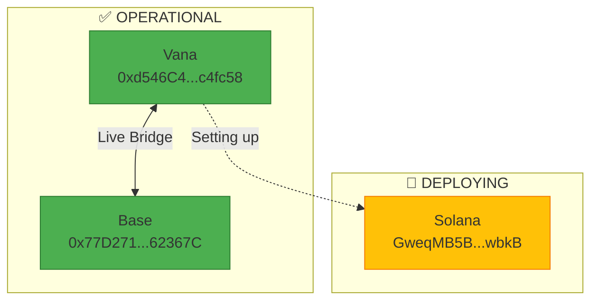

# RDAT Multichain Status Overview

**Date**: September 23rd, 2025

## 🌐 Network Status



## 📊 Deployment Summary

| Network | Status | Contract | Type | Bridge Ready |
|---------|--------|----------|------|--------------|
| **Vana** | ✅ Live | `0xd546C45872eeA596155EAEAe9B8495f02ca4fc58` | OFT Adapter | ✅ Yes |
| **Base** | ✅ Live | `0x77D2713972af12F1E3EF39b5395bfD65C862367C` | RDAT OFT | ✅ Yes |
| **Solana** | ✅ Live | `BQWFM5WBsHcAqQszdRtW2r5suRciePEFKeRrEJChax4f` | OFT Program | 🔧 Setup |

## 💰 Financial Status

### Deployment Costs (Actual)
- **Vana**: 0.00005 VANA (~$0.05)
- **Base**: 0.00005 ETH (~$0.15)
- **Solana**: ~0.5 SOL (pending)

### Current Balances
- **Vana Deployer**: 1.17 VANA remaining
- **Base Deployer**: 0.02 ETH remaining
- **Solana Deployer**: 1.02 SOL available

## 🔄 Bridge Operations

### Vana ↔ Base (LIVE)
```
Users can now:
1. Bridge RDAT from Vana to Base
2. Return RDAT from Base to Vana
3. Track on LayerZero Scan
```

### Vana ↔ Solana (SOON)
```
After deployment:
1. Set peer connections
2. Test with small amounts
3. Enable for users
```

## 📝 User Access

### Current Options
- **Direct Contract**: ✅ Working via Vanascan/Basescan
- **Stargate UI**: ⏳ Pending integration request
- **Superbridge**: ⏳ May auto-detect

### For Developers
```bash
# Bridge Vana to Base
1. Approve RDAT on Vana
2. Call send() with Base EID (30184)
3. Receive on Base in 1-3 minutes

# Bridge Base to Vana
1. Call send() with Vana EID (30330)
2. Receive on Vana in 1-3 minutes
```

## 🎯 Next Milestones

### Immediate (Today)
- [x] Deploy Vana adapter
- [x] Deploy Base OFT
- [x] Configure peers
- [x] Test bridge
- [ ] Deploy Solana OFT (in progress)

### This Week
- [ ] Complete Solana integration
- [ ] Submit to Stargate for UI
- [ ] Create video tutorial
- [ ] Community announcement

### This Month
- [ ] Monitor bridge volume
- [ ] Optimize gas costs
- [ ] Add more chains (per LayerZero expansion)

## 📈 Success Metrics

- **Contracts Deployed**: 2/3 (67%)
- **Bridges Active**: 1/2 (50%)
- **Networks Connected**: 2/3 (67%)
- **Total Supply Maintained**: ✅ 100M RDAT

## 🔗 Important Links

### Explorers
- [Vanascan](https://vanascan.io/address/0xd546C45872eeA596155EAEAe9B8495f02ca4fc58)
- [Basescan](https://basescan.org/address/0x77D2713972af12F1E3EF39b5395bfD65C862367C)
- [Solana Explorer](https://explorer.solana.com/)
- [LayerZero Scan](https://layerzeroscan.com/)

### Documentation
- [User Bridging Guide](USER_BRIDGING_GUIDE.md)
- [Architecture](ARCHITECTURE.md)
- [Deployment Audit Trail](DEPLOYMENT_AUDIT_TRAIL.md)

## 🚀 Current Activity

**NOW**: Solana OFT deployed! Setting up LayerZero configuration
- ✅ Program deployed: `BQWFM5WBsHcAqQszdRtW2r5suRciePEFKeRrEJChax4f`
- 🔧 Next: Create OFT Store account
- 🎯 Then: Configure Vana as peer
- Explorer: https://explorer.solana.com/address/BQWFM5WBsHcAqQszdRtW2r5suRciePEFKeRrEJChax4f

---

*This document provides real-time status of the RDAT multichain deployment.*