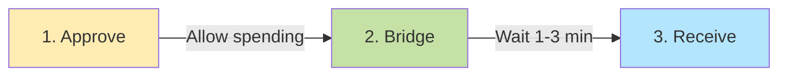

# RDAT Bridge Quick Start

## 🌉 Visual Overview

## 🚀 Bridge Your RDAT in 3 Steps

### Step 1: Approve
Go to [Vanascan Token Page](https://vanascan.io/address/0x2c1CB448cAf3579B2374EFe20068Ea97F72A996E#writeContract)
- Function: `approve`
- Spender: `0xd546C45872eeA596155EAEAe9B8495f02ca4fc58`
- Amount: Your amount with 18 zeros (e.g., 100 RDAT = `100000000000000000000`)

### Step 2: Bridge
Go to [Bridge Contract Page](https://vanascan.io/address/0xd546C45872eeA596155EAEAe9B8495f02ca4fc58#writeContract)
- Function: `send`
- Include ~0.001 VANA for fees
- Wait 1-3 minutes

### Step 3: Verify
Check your tokens on [Base](https://basescan.org/address/0x77D2713972af12F1E3EF39b5395bfD65C862367C)

## 📍 Contract Addresses

| What | Address |
|------|---------|
| RDAT Token (Vana) | `0x2c1CB448cAf3579B2374EFe20068Ea97F72A996E` |
| Bridge (Vana) | `0xd546C45872eeA596155EAEAe9B8495f02ca4fc58` |
| RDAT OFT (Base) | `0x77D2713972af12F1E3EF39b5395bfD65C862367C` |

## 💡 Tips
- Start with small amounts
- Have VANA for Vana gas, ETH for Base gas
- Track on [LayerZero Scan](https://layerzeroscan.com/)

---
*For detailed instructions, see [USER_BRIDGING_GUIDE.md](USER_BRIDGING_GUIDE.md)*