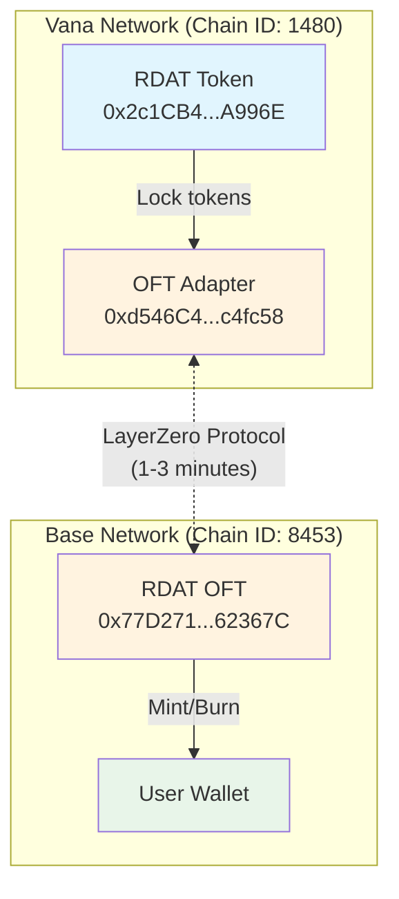

# RDAT Multichain - LayerZero V2 Implementation

**Status**: 🟢 **LIVE** - Bridge Operational across Vana, Base, and Solana as of September 23rd, 2025

RDAT is now an omnichain token bridging Vana, Base, and Solana networks using LayerZero V2 OFT standard.

## Deployed Contracts

### Mainnet Deployments (LIVE)

| Network | Contract Type | Address | Status |
|---------|--------------|---------|--------|
| **Vana** | OFT Adapter | [`0xd546C45872eeA596155EAEAe9B8495f02ca4fc58`](https://vanascan.io/address/0xd546C45872eeA596155EAEAe9B8495f02ca4fc58) | ✅ Live |
| **Base** | RDAT OFT | [`0x77D2713972af12F1E3EF39b5395bfD65C862367C`](https://basescan.org/address/0x77D2713972af12F1E3EF39b5395bfD65C862367C) | ✅ Live |
| **Solana** | OFT Program | [`BQWFM5WBsHcAqQszdRtW2r5suRciePEFKeRrEJChax4f`](https://explorer.solana.com/address/BQWFM5WBsHcAqQszdRtW2r5suRciePEFKeRrEJChax4f) | ✅ Live |

### Bridge Status
- ✅ Peer connections established
- ✅ Multisig ownership configured
- ✅ Ready for production use
- 📊 Monitor on [LayerZero Scan](https://layerzeroscan.com/)

## Quick Start

### For Users - Bridging RDAT

1. **Vana to Base**: Lock RDAT on Vana to receive on Base
2. **Base to Vana**: Burn RDAT on Base to unlock on Vana

📖 **Bridging Guides**:
- [`USER_BRIDGING_GUIDE.md`](USER_BRIDGING_GUIDE.md) - Complete user guide with UI options
- [`TEST_BRIDGE.md`](TEST_BRIDGE.md) - Technical testing instructions

### For Developers - Deployment (Already Complete)

The deployment process has been completed. For historical reference:
1. Contracts deployed using Foundry
2. Multisig ownership set during deployment
3. Peer connections configured via multisig transactions
4. Bridge tested and operational

## How It Works

### Bridge Operations
- **Vana → Base**: Lock RDAT in adapter → Mint OFT on Base
- **Base → Vana**: Burn OFT on Base → Unlock RDAT from adapter
- **Time**: ~1-3 minutes per transfer
- **Fees**: Small LayerZero fee in native tokens (VANA/ETH)

## Bridge User Interfaces

| Interface | Status | Notes |
|-----------|--------|-------|
| **Direct Contract** | ✅ Live | Use Vanascan/Basescan |
| **Stargate Finance** | ⏳ Pending | Requires manual addition |
| **Superbridge** | ⏳ Check | May auto-detect OFT |
| **Jumper.exchange** | ⏳ Check | May require request |

## Documentation

### User Guides
- [`USER_BRIDGING_GUIDE.md`](USER_BRIDGING_GUIDE.md) - **How to bridge RDAT tokens**
- [`TEST_BRIDGE.md`](TEST_BRIDGE.md) - Bridge testing instructions

### Technical Documentation
- [`PLAN.md`](PLAN.md) - Architecture and design decisions
- [`DEPLOYMENT.md`](DEPLOYMENT.md) - Step-by-step deployment guide
- [`DEPLOYMENT_AUDIT_TRAIL.md`](DEPLOYMENT_AUDIT_TRAIL.md) - Complete deployment history
- [`MULTISIG_SETUP_INSTRUCTIONS.md`](MULTISIG_SETUP_INSTRUCTIONS.md) - Multisig configuration
- [`foundry/README.md`](foundry/README.md) - Technical implementation

## Key Addresses

| Network | Contract/Purpose | Address |
|---------|-----------------|---------|
| Vana | RDAT Token | `0x2c1CB448cAf3579B2374EFe20068Ea97F72A996E` |
| Vana | **OFT Adapter** | **`0xd546C45872eeA596155EAEAe9B8495f02ca4fc58`** ✅ |
| Vana | LayerZero Endpoint | `0xcb566e3B6934Fa77258d68ea18E931fa75e1aaAa` |
| Vana | Multisig | `0xe4F7Eca807C57311e715C3Ef483e72Fa8D5bCcDF` |
| Base | **RDAT OFT** | **`0x77D2713972af12F1E3EF39b5395bfD65C862367C`** ✅ |
| Base | LayerZero Endpoint | `0x1a44076050125825900e736c501f859c50fE728c` |
| Base | Multisig | `0x90013583c66D2bf16327cB5Bc4a647AcceCF4B9A` |
| Solana | Deployer Wallet | `FFMX53TNrX3fRNXC6uGDZEis9NZpTbEV2d53dcwt4rGM` |

## Implementation

The Foundry implementation in `/foundry` contains:
- Smart contracts (`src/`)
- Deployment scripts (`script/`)
- Fork tests (`test/`)

## Security

- Git hooks prevent accidental key commits
- Multisig ownership for all contracts
- Standard LayerZero contracts (no custom code)
- Fork testing before mainnet deployment