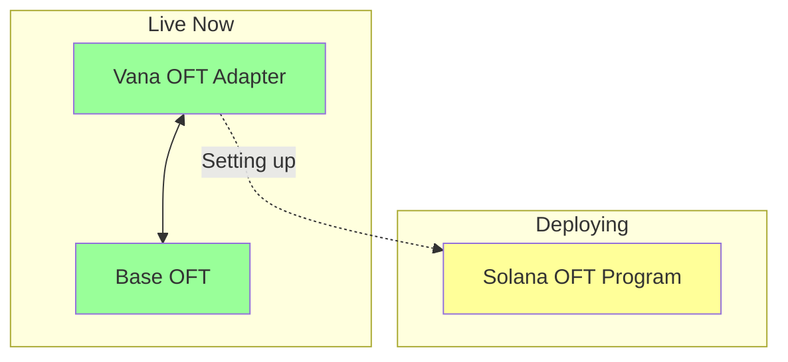

# Solana OFT Deployment Status

**Date**: September 23rd, 2025
**Time**: In Progress

## ✅ Completed Steps

1. **Wallet Setup**
   - Wallet Address: `FFMX53TNrX3fRNXC6uGDZEis9NZpTbEV2d53dcwt4rGM`
   - Balance: 1.02 SOL ✅
   - Keypair: `solana-deployer.json`

2. **Project Initialization**
   - LayerZero OFT example cloned ✅
   - Dependencies installed ✅
   - Anchor workspace configured ✅

3. **Program Configuration**
   - Program ID: `BQWFM5WBsHcAqQszdRtW2r5suRciePEFKeRrEJChax4f`
   - Anchor.toml updated ✅
   - Using LayerZero's working example ✅

## ✅ Deployment Complete!

**Program Successfully Deployed!**
- Program ID: `BQWFM5WBsHcAqQszdRtW2r5suRciePEFKeRrEJChax4f`
- Data Length: 557,168 bytes
- Authority: `FFMX53TNrX3fRNXC6uGDZEis9NZpTbEV2d53dcwt4rGM`
- Deployed in Slot: 368726512
- Balance: 3.88 SOL (rent-exempt)

## 📋 Next Steps

Once build completes:

1. **Deploy Program**
   ```bash
   solana program deploy \
     --program-id target/deploy/oft-keypair.json \
     target/deploy/oft.so \
     -u mainnet-beta \
     --keypair keypair.json
   ```

2. **Create OFT Store**
   ```bash
   # Initialize OFT with LayerZero configuration
   pnpm hardhat lz:oft:solana:create \
     --eid 30168 \
     --program-id GweqMB5BKttDacUJtw8PqFndTXSscNQquj6XGWjYwbkB \
     --shared-decimals 6 \
     --local-decimals 9
   ```

3. **Configure Peers**
   ```bash
   # Set Vana as peer
   pnpm hardhat lz:oft:solana:set-peer \
     --eid 30168 \
     --peer-eid 30330 \
     --peer-address 0xd546C45872eeA596155EAEAe9B8495f02ca4fc58
   ```

## 🌉 Bridge Architecture



## 📊 Integration Points

| Network | Contract | Status |
|---------|----------|--------|
| Vana | `0xd546C45872eeA596155EAEAe9B8495f02ca4fc58` | ✅ Live |
| Base | `0x77D2713972af12F1E3EF39b5395bfD65C862367C` | ✅ Live |
| Solana | `BQWFM5WBsHcAqQszdRtW2r5suRciePEFKeRrEJChax4f` | ✅ Deployed |

## 💰 Cost Tracking

- Initial wallet: 0.01 SOL
- Added funding: 1.01 SOL
- **Total available**: 1.02 SOL
- **Expected deployment cost**: ~0.5 SOL
- **Remaining after deploy**: ~0.52 SOL

## ⚠️ Important Notes

1. **Mainnet Beta**: Solana LayerZero is in Mainnet Beta
2. **Limited Chains**: Currently supports 8 chains (not all 70)
3. **Hub Model**: Using Vana as hub for liquidity

## 🔗 Resources

- Solana Program: `/Users/nissan/code/rdat-multichain/solana-oft/oft-solana`
- LayerZero Docs: https://docs.layerzero.network/v2/developers/solana
- Solana Explorer: https://explorer.solana.com/

---

**Status**: ✅ OFT Program deployed to Solana mainnet!
**Next Steps**: Create OFT Store account and configure peer connections