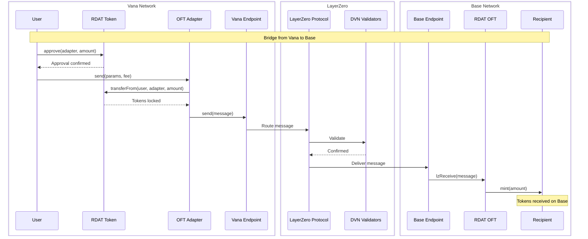
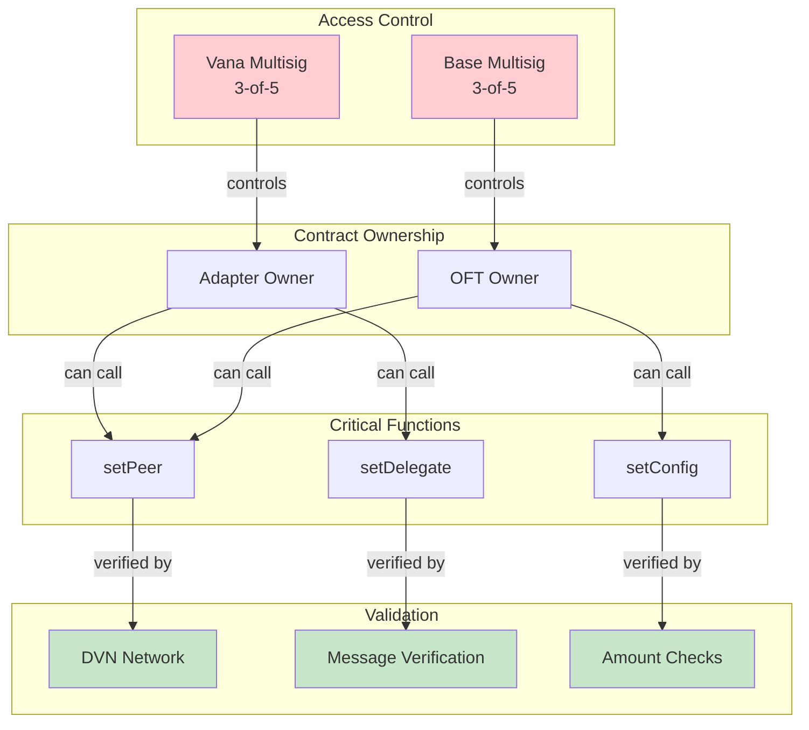
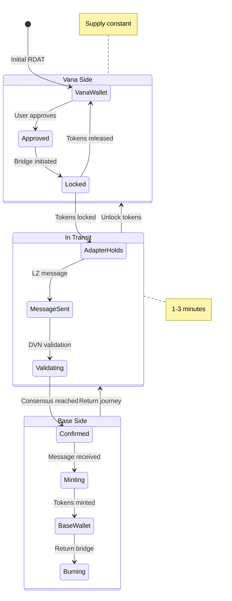
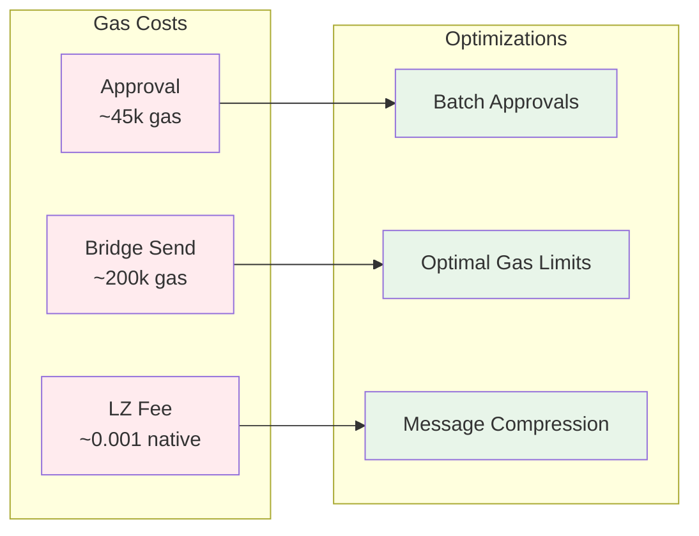

# RDAT Multichain Architecture

## System Overview

```mermaid
graph TB
    subgraph "Users"
        U1[Vana Users]
        U2[Base Users]
    end

    subgraph "Vana Mainnet"
        VT[\"RDAT Token<br/>(Original)<br/>0x2c1CB4...A996E\"]
        VA[\"OFT Adapter<br/>0xd546C4...c4fc58\"]
        VE[\"LayerZero Endpoint<br/>0xcb566e...1aaAa\"]
        VM[\"Multisig<br/>0xe4F7Ec...9D5bCcDF\"]

        VT -.->|locks/unlocks| VA
        VA <-->|messages| VE
        VM -->|owns| VA
    end

    subgraph "LayerZero Network"
        LZ[LayerZero Protocol]
        DVN[DVN Validators]
        EX[Executors]

        LZ --> DVN
        LZ --> EX
    end

    subgraph "Base Mainnet"
        BO[\"RDAT OFT<br/>0x77D271...62367C\"]
        BE[\"LayerZero Endpoint<br/>0x1a4407...728c\"]
        BM[\"Multisig<br/>0x90013583...4B9A\"]

        BO <-->|messages| BE
        BM -->|owns| BO
    end

    U1 -->|interacts| VT
    U1 -->|bridges| VA
    U2 -->|holds| BO

    VE <-.->|EID: 30330| LZ
    BE <-.->|EID: 30184| LZ

    style VT fill:#e3f2fd
    style BO fill:#e8f5e9
    style VA fill:#fff3e0
    style VM fill:#ffcdd2
    style BM fill:#ffcdd2
    style LZ fill:#f3e5f5
```

## Contract Interactions



## Security Architecture



## Token Flow States



## Key Components

### 1. Token Contracts
- **RDAT Token (Vana)**: Original token with 100M supply
- **OFT Adapter (Vana)**: Locks/unlocks original tokens
- **RDAT OFT (Base)**: Mints/burns representations

### 2. LayerZero Infrastructure
- **Endpoints**: Handle cross-chain messaging
- **DVN**: Decentralized verification network
- **Executors**: Process message delivery

### 3. Security
- **Multisig Control**: All admin functions
- **Peer Trust**: Explicit contract pairing
- **No Upgradability**: Immutable contracts

## Deployment Information

| Component | Address | Network | EID |
|-----------|---------|---------|-----|
| RDAT Token | `0x2c1CB448cAf3579B2374EFe20068Ea97F72A996E` | Vana | - |
| OFT Adapter | `0xd546C45872eeA596155EAEAe9B8495f02ca4fc58` | Vana | 30330 |
| RDAT OFT | `0x77D2713972af12F1E3EF39b5395bfD65C862367C` | Base | 30184 |
| Vana Endpoint | `0xcb566e3B6934Fa77258d68ea18E931fa75e1aaAa` | Vana | - |
| Base Endpoint | `0x1a44076050125825900e736c501f859c50fE728c` | Base | - |

## Gas Optimization



---

*This document provides a complete technical overview of the RDAT multichain architecture.*