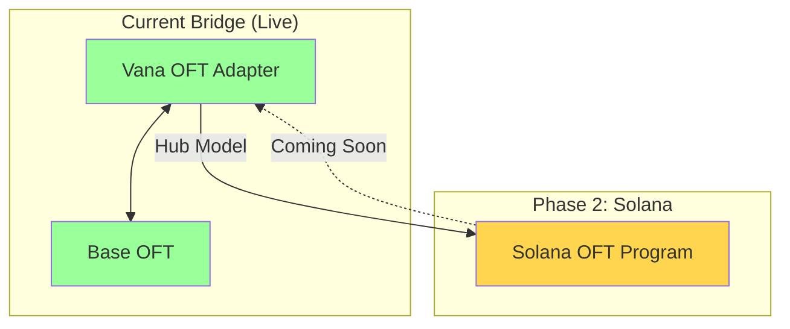
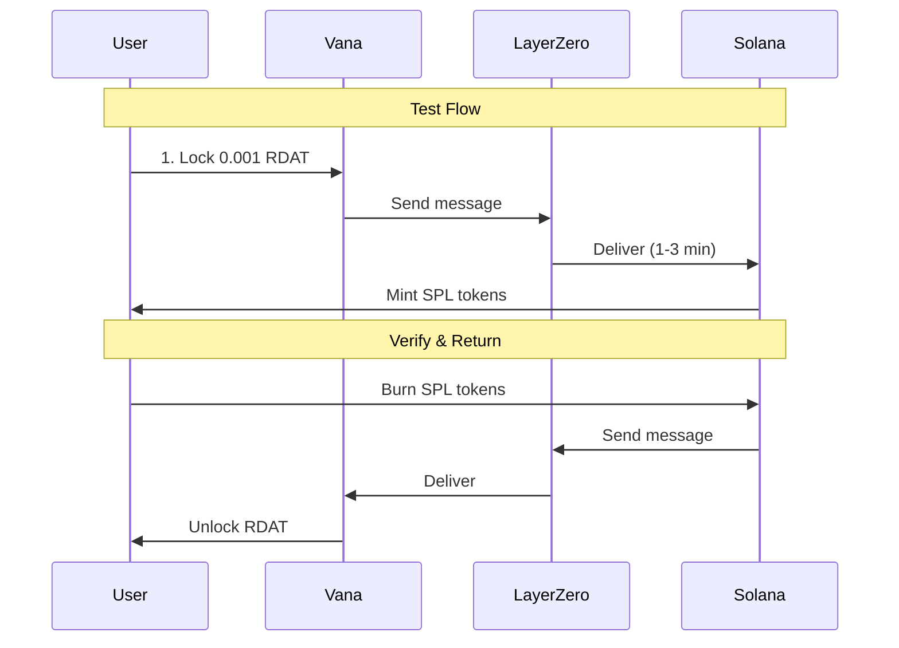

# RDAT Solana OFT Deployment Plan

## Current Status
- ✅ **Vana-Base Bridge**: Operational
- ✅ **Solana Wallet**: Created and funded with 0.01 SOL
- ✅ **Keypair**: `solana-deployer.json` ready
- ✅ **Wallet Address**: `FFMX53TNrX3fRNXC6uGDZEis9NZpTbEV2d53dcwt4rGM`

## Architecture Overview



## Deployment Requirements

### 1. Technical Prerequisites
- [ ] Solana CLI v1.17.31
- [ ] Anchor framework v0.29.0
- [ ] Docker (for verifiable builds)
- [ ] Node.js & pnpm
- [ ] `solana-verify` tool

### 2. Financial Requirements
- ✅ 0.01 SOL in wallet (current balance)
- [ ] Need additional ~0.5-1 SOL for deployment
- [ ] Priority fees for network congestion

### 3. LayerZero Configuration
- **Solana EID**: 30168
- **Connected Chains**: Currently 8 chains in Mainnet Beta
- **Hub Connection**: Vana as primary hub

## Implementation Steps

### Step 1: Setup Solana OFT Project

```bash
# Create new Solana OFT project
cd /Users/nissan/code/rdat-multichain
mkdir solana-oft
cd solana-oft

# Initialize with LayerZero CLI
LZ_ENABLE_SOLANA_OFT_EXAMPLE=1 npx create-lz-oapp@latest

# Project name: rdat-solana-oft
```

### Step 2: Configure Environment

```bash
# Install correct versions
solana-install init 1.17.31
anchor-cli 0.29.0

# Set cluster
solana config set --url mainnet-beta

# Set keypair
solana config set --keypair ../solana-deployer.json
```

### Step 3: Configure Token Parameters

```typescript
// Configuration for RDAT OFT
{
  name: "RDAT",
  symbol: "RDAT",
  decimals: 18,          // Match EVM chains
  sharedDecimals: 6,     // Solana standard
  localDecimals: 9,      // SPL token standard
  supply: 0,             // Mint/burn model
  hub: "vana",           // Vana as hub
  eid: 30168            // Solana EID
}
```

### Step 4: Build Program

```bash
# Build in verifiable mode (requires Docker)
anchor build --verifiable

# Or regular build
anchor build
```

### Step 5: Deploy OFT Program

```bash
# Deploy with priority fees
solana program deploy \
  --program-id target/deploy/oft-keypair.json \
  target/verifiable/oft.so \
  -u mainnet-beta \
  --keypair ../solana-deployer.json \
  --with-compute-unit-price 1000
```

### Step 6: Create OFT Store

```bash
# Create OFT Store Account (PDA)
pnpm hardhat lz:oft:solana:create \
  --eid 30168 \
  --program-id <DEPLOYED_PROGRAM_ID> \
  --mint-authority ../solana-deployer.json \
  --shared-decimals 6 \
  --local-decimals 9
```

### Step 7: Wire with Vana

```bash
# Set Vana as peer
pnpm hardhat lz:oft:solana:set-peer \
  --eid 30168 \
  --peer-eid 30330 \
  --peer-address 0xd546C45872eeA596155EAEAe9B8495f02ca4fc58
```

### Step 8: Configure Vana Side

On Vana, the multisig needs to:
```solidity
// Add Solana as trusted peer
setPeer(
  30168,  // Solana EID
  <SOLANA_OFT_BYTES32>
)
```

## Cost Estimates

| Item | Cost | Status |
|------|------|--------|
| Program Deployment | ~0.5-1 SOL | ❌ Need funding |
| OFT Store Creation | ~0.02 SOL | ✅ Have funds |
| Transaction Fees | ~0.001 SOL/tx | ✅ Have funds |
| Rent Exemption | ~0.01 SOL | ✅ Have funds |

**Total Needed**: ~0.5-1 SOL additional funding

## Architecture Decisions

### 1. Hub Model vs Full Mesh
- **Decision**: Use Vana as hub
- **Rationale**: Simplifies liquidity management
- **Flow**: Solana ↔ Vana ↔ Base

### 2. Token Program Choice
- **Decision**: Use original SPL Token Program
- **Rationale**: Better compatibility, proven stability
- **Alternative**: Token-2022 (not recommended yet)

### 3. Decimals Configuration
- **Shared Decimals**: 6 (Solana standard)
- **Local Decimals**: 9 (SPL standard)
- **Conversion**: Handled by LayerZero

## Security Considerations

1. **Program Authority**: Set to multisig after deployment
2. **Upgrade Authority**: Consider making immutable
3. **OFT Store Owner**: Transfer to multisig
4. **Peer Configuration**: Requires multisig on both sides

## Testing Plan



## Monitoring & Verification

1. **Solana Explorer**: https://explorer.solana.com/
2. **LayerZero Scan**: https://layerzeroscan.com/
3. **Program Verification**: Use `solana-verify`

## Risk Analysis

| Risk | Impact | Mitigation |
|------|--------|------------|
| Network Congestion | High fees | Use priority fees |
| Program Bug | Token loss | Use audited LayerZero code |
| Authority Compromise | Control loss | Multisig from start |
| Decimal Mismatch | Value loss | Careful configuration |

## Next Steps

1. **Immediate**:
   - [ ] Fund wallet with additional 0.5-1 SOL
   - [ ] Install required tools

2. **Setup Phase**:
   - [ ] Initialize Solana OFT project
   - [ ] Configure Anchor workspace
   - [ ] Set up verifiable build

3. **Deployment**:
   - [ ] Deploy OFT program
   - [ ] Create OFT Store
   - [ ] Configure peers

4. **Testing**:
   - [ ] Small amount bridge test
   - [ ] Verify on explorers
   - [ ] Document results

## Timeline Estimate

- **Day 1**: Setup and configuration
- **Day 2**: Build and deployment
- **Day 3**: Testing and verification
- **Day 4**: Documentation and handover

## Success Criteria

- [ ] OFT Program deployed to Solana mainnet
- [ ] Successful bridge Vana → Solana → Vana
- [ ] Program verified on-chain
- [ ] Documentation complete
- [ ] Multisig control established

---

**Note**: Solana LayerZero is in Mainnet Beta (Sept 2025), supporting 8 chains initially. Full 70-chain support coming after final audits.