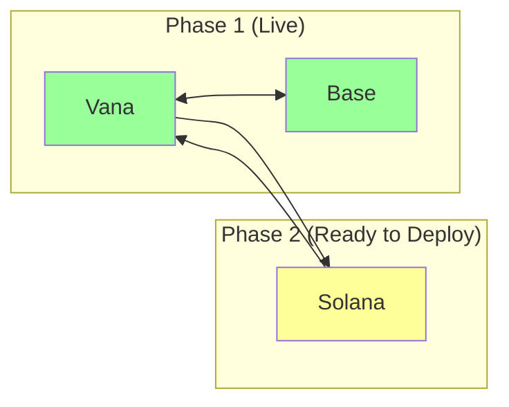

# Solana OFT Deployment - Ready Checklist

## ✅ What We Have Ready

1. **Wallet & Keys**
   - ✅ Keypair: `solana-deployer.json`
   - ✅ Address: `FFMX53TNrX3fRNXC6uGDZEis9NZpTbEV2d53dcwt4rGM`
   - ✅ Balance: 0.01 SOL

2. **Tools Installed**
   - ✅ Solana CLI: v2.1.22
   - ✅ Anchor: v0.31.1
   - ✅ Node.js & npm/pnpm

3. **Bridge Infrastructure**
   - ✅ Vana-Base bridge operational
   - ✅ LayerZero endpoints verified
   - ✅ Multisig control established

## ❌ What We Need

1. **Additional Funding**
   - **Current**: 0.01 SOL
   - **Needed**: 0.5-1 SOL more
   - **For**: Program deployment (~0.5 SOL) + rent exemption

2. **Version Adjustments** (Optional)
   - LayerZero recommends Anchor 0.29.0 (we have 0.31.1)
   - Solana 1.17.31 (we have 2.1.22)
   - Should work with current versions

## 🚀 Quick Deployment Commands

Once funded, here's the rapid deployment path:

```bash
# 1. Setup project
cd /Users/nissan/code/rdat-multichain
LZ_ENABLE_SOLANA_OFT_EXAMPLE=1 npx create-lz-oapp@latest
# Choose: solana-oft

# 2. Configure
cd solana-oft
cp ../solana-deployer.json ./keypair.json

# 3. Build
anchor build

# 4. Deploy (needs ~0.5 SOL)
solana program deploy \
  --program-id target/deploy/oft-keypair.json \
  target/deploy/oft.so \
  -u mainnet-beta \
  --keypair keypair.json

# 5. Create OFT Store
# Will use LayerZero scripts
```

## 📊 Deployment Decision

### Option A: Deploy Now (Needs Funding)
**Pros:**
- Complete multichain solution
- First-mover advantage on Solana
- Full LayerZero V2 integration

**Cons:**
- Need additional 0.5-1 SOL (~$75-150)
- Solana in Mainnet Beta (8 chains only)
- Additional complexity

### Option B: Wait for Full Release
**Pros:**
- All 70 chains connected
- More mature tooling
- Learn from other deployments

**Cons:**
- Miss early adoption
- Community waiting for Solana

## 🎯 Recommended Next Steps

1. **If proceeding now**:
   ```bash
   # Send 1 SOL to:
   FFMX53TNrX3fRNXC6uGDZEis9NZpTbEV2d53dcwt4rGM
   ```

2. **Start setup while waiting for funds**:
   ```bash
   # We can initialize the project structure
   cd /Users/nissan/code/rdat-multichain
   mkdir solana-oft
   # Prepare configuration files
   ```

3. **Test on Devnet first** (Free):
   ```bash
   # Switch to devnet for testing
   solana config set --url devnet
   # Airdrop test SOL
   solana airdrop 2
   ```

## 💰 Funding Summary

| Purpose | Amount | USD Estimate |
|---------|--------|--------------|
| Program Deploy | 0.5 SOL | ~$75 |
| Rent Exemption | 0.1 SOL | ~$15 |
| Testing/Fees | 0.1 SOL | ~$15 |
| Buffer | 0.3 SOL | ~$45 |
| **Total Needed** | **1 SOL** | **~$150** |

## 🔄 Integration with Existing Bridge



## ⚡ Quick Decision

**Question**: Should we proceed with Solana deployment?

**If YES**:
1. Fund wallet with 1 SOL
2. Run deployment (takes ~1 hour)
3. Test bridge functionality

**If WAIT**:
1. Monitor LayerZero announcements
2. Keep infrastructure ready
3. Deploy when optimal

---

*Current Status: Ready to deploy, awaiting funding decision*