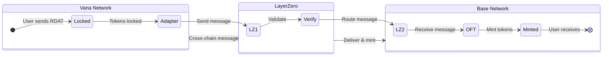

# RDAT Multichain Deployment Plan

**Date**: September 23rd, 2025
**Status**: ✅ **DEPLOYED & OPERATIONAL**
**Implementation**: Foundry + LayerZero V2

## Overview

Deploy RDAT as an omnichain token using LayerZero V2 OFT (Omnichain Fungible Token) standard.

### Architecture

- **Canonical Chain**: Vana Mainnet
  - Existing RDAT token: `0x2c1CB448cAf3579B2374EFe20068Ea97F72A996E`
  - ✅ Deployed: `RdatOFTAdapter` at `0xd546C45872eeA596155EAEAe9B8495f02ca4fc58`

- **Satellite Chain**: Base Mainnet
  - ✅ Deployed: `RdatOFT` at `0x77D2713972af12F1E3EF39b5395bfD65C862367C`

- **Future**: Solana Mainnet (Phase 2)
  - Wallet created: `FFMX53TNrX3fRNXC6uGDZEis9NZpTbEV2d53dcwt4rGM`
  - Funded with SOL (ready for deployment)

### Bridge Mechanism



**Flow Summary**:
- Vana → Base: Lock RDAT in adapter → Mint OFT on Base
- Base → Vana: Burn OFT on Base → Unlock RDAT from adapter

## Configuration

### Chain Details

| Chain | Chain ID | EID | Endpoint | Multisig/Wallet |
|-------|----------|-----|----------|-----------------|
| Vana | 1480 | 30330 | `0xcb566e3B6934Fa77258d68ea18E931fa75e1aaAa` | `0xe4F7Eca807C57311e715C3Ef483e72Fa8D5bCcDF` |
| Base | 8453 | 30184 | `0x1a44076050125825900e736c501f859c50fE728c` | `0x90013583c66D2bf16327cB5Bc4a647AcceCF4B9A` |
| Solana | N/A | 30168 | Uses ULN & Executor programs | `FFMX53TNrX3fRNXC6uGDZEis9NZpTbEV2d53dcwt4rGM` |

### Deployment Wallet
- Address: `0x58eCB94e6F5e6521228316b55c465ad2A2938FbB`
- ✅ Funded and deployment complete
- Gas used: 0.00005 VANA + 0.00005 ETH

## Design Decisions

### 1. Development Stack
- **Foundry** over Hardhat - Industry standard 2025
- **Git submodules** over npm/pnpm - No JS dependency issues
- **Direct mainnet** - No testnet available (Vana Moksha lacks LayerZero)

### 2. Security Configuration
- **DVN**: LayerZero Labs (trusted default)
- **Multisigs**: Use existing from rdatadao-contracts
- **Gas Limits**: 80,000 for EVM-to-EVM (standard)
- **Audit**: Not required (standard LayerZero contracts)

### 3. Implementation Choices
- **No new token on Vana** - Wrap existing RDAT
- **New token on Base** - Mint/burn representations
- **No rate limits initially** - Monitor post-deployment
- **Solana deferred** - Focus on EVM chains first

## Phase 2: Solana Integration

### Status
- ✅ Wallet created: `FFMX53TNrX3fRNXC6uGDZEis9NZpTbEV2d53dcwt4rGM`
- ✅ Wallet funded with SOL on mainnet
- ✅ Keypair saved: `solana-deployer.json`
- ⏳ Awaiting successful Vana-Base bridge deployment

### Solana OFT Configuration
- **Program Type**: SPL-compatible OFT
- **EID**: 30168
- **Connection**: Initially Vana ↔ Solana (hub model)

### Deployment Command
```bash
# When ready for Phase 2
solana-keygen pubkey solana-deployer.json
# Should output: FFMX53TNrX3fRNXC6uGDZEis9NZpTbEV2d53dcwt4rGM

# Deploy OFT program
anchor deploy --provider.cluster mainnet-beta --keypair solana-deployer.json
```

## Project Structure

```
rdat-multichain/
├── foundry/                    # Main implementation
│   ├── src/
│   │   ├── RdatOFTAdapter.sol # Vana: wraps existing RDAT
│   │   └── RdatOFT.sol        # Base: new token
│   ├── script/
│   │   ├── DeployVanaAdapter.s.sol
│   │   ├── DeployBaseOFT.s.sol
│   │   ├── WireContracts.s.sol
│   │   └── TestBridge.s.sol
│   └── test/
│       └── ForkTest.t.sol
└── rdatadao-contracts/        # Symlink to existing contracts
```

## Testing Strategy

Since Vana Moksha testnet doesn't have LayerZero:

1. **Fork Testing**: Test against forked mainnet
2. **Simulation**: Run deployment simulation scripts
3. **Small Amounts**: Test with minimal RDAT first
4. **Monitoring**: Use LayerZero Scanner post-deployment

## Risk Management

| Risk | Mitigation |
|------|------------|
| Wrong endpoint | Verified via script |
| Peer misconfiguration | Scripted setPeer calls |
| No testnet | Fork testing + simulations |
| Bridge exploit | Standard contracts + multisig control |
| Supply inconsistency | Total always 100M across chains |

## LayerZero Deployed Contracts

### DVN Addresses (Mainnet)
- **LayerZero Labs DVN**: Check at deployment time via https://docs.layerzero.network/v2/developers/evm/technical-reference/dvn-addresses

### Executor Addresses
- **LayerZero Executor**: Check at deployment time via https://docs.layerzero.network/v2/developers/evm/technical-reference/executor-addresses

### Libraries
- **SendUln302**: Default send library
- **ReceiveUln302**: Default receive library

## Resources

### LayerZero Documentation
- **Main Docs**: https://docs.layerzero.network/v2
- **EVM Chain IDs**: https://docs.layerzero.network/v2/developers/evm/technical-reference/deployed-contracts
- **Solana Chain IDs**: https://docs.layerzero.network/v2/developers/solana/technical-reference/deployed-contracts
- **OFT Quickstart**: https://docs.layerzero.network/v2/developers/evm/oft/quickstart
- **Solana OFT**: https://docs.layerzero.network/v2/developers/solana/oft/quickstart
- **Message Options**: https://docs.layerzero.network/v2/developers/evm/protocol-gas-settings/options
- **DVN Configuration**: https://docs.layerzero.network/v2/developers/evm/protocol-gas-settings/default-config
- **LayerZero Scanner**: https://layerzeroscan.com/

### Reference Implementation
- **Existing RDAT**: `/Users/nissan/code/rdatadao-contracts/`